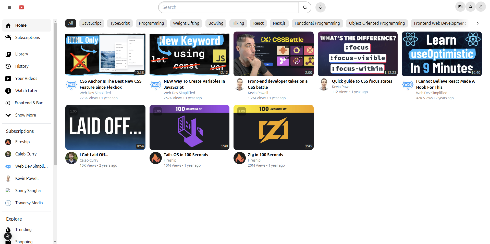

This project is a clone of YouTube using React, Next.js, and Tailwind CSS.



# Getting Started

### First, install the dependencies:

```bash
npm install
```

### then, run dev server:

```bash
npm run dev
```